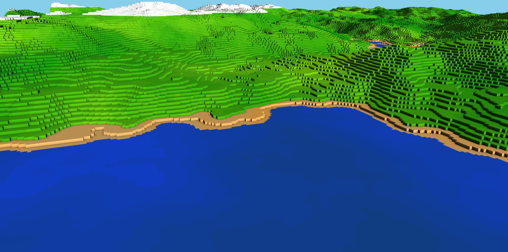

# KUBE
Simple minecraft-like game and rendering engine based on OpenGL. Focus on new standards and state-of-the-art technologies. Educational project.

## Dependencies
* [GLFW](http://www.glfw.org) 3.2
* [CMake](https://cmake.org) 3.1
* [GLM](http://glm.g-truc.net) 0.9.8
* Freetype 2.7
* libnoise 1.0
* OpenGL 4.5
* C++14 Compiler (GCC 5+, Clang 3.4+)

## Build instructions
### Linux
#### Installing Dependencies using APT (Ubuntu, Debian et al.)
```
apt-get install libglfw3 libglfw3-dev cmake libglm-dev libnoise-dev libfreetype6-dev
```
On some older distros (Ubuntu 16.04 and below) GLFW 3.2 and GLM 0.9.8 is not part of the official repositories. You should therefore build it from source. (See below)
Also on some distros, libnoise is getting installed to a different location than the official release. Solution: Adapt code, move files or build from source.

#### Installing Dependencies using pacman (Arch Linux)
```
pacman -Syu glfw cmake glm libnoise freetype2
```

#### Installing GLFW 3.2 from source
```
git clone https://github.com/glfw/glfw.git
cd glfw
mkdir build
cd build
cmake -D BUILD_SHARED_LIBS=ON ..
sudo make install
```

#### Installing GLM 0.9.8 from source
```
git clone https://github.com/g-truc/glm.git
cd glm
mkdir build
cd build
cmake ..
sudo make install
```

#### Installing libnoise 1.0 from source
```
git clone https://github.com/qknight/libnoise.git
cd libnoise
mkdir build
cd build
cmake ..
sudo make install
```

#### Build KUBE
Checkout the project and make sure you have installed all dependencies.

```
mkdir build
cd build
cmake ..
make
```

It's that simple! Executables for the sample projects are now in the build folder.

### Windows
Todo
### OSX
Todo

## Features
* Phong Shading
* Ambient Occlusion
* Procedural Terrain Generation
* Dynamic Loading of Terratin
